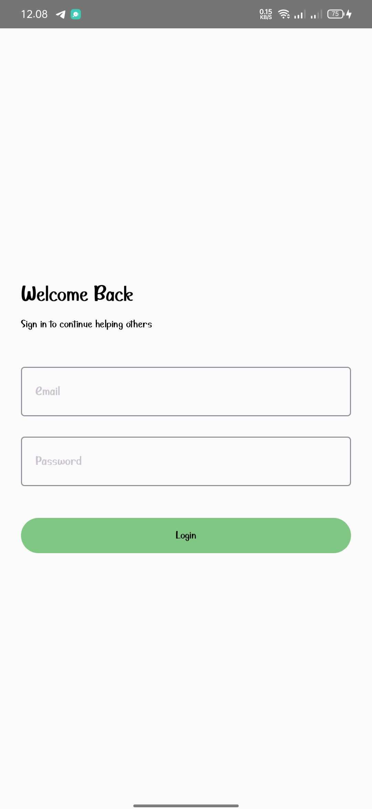
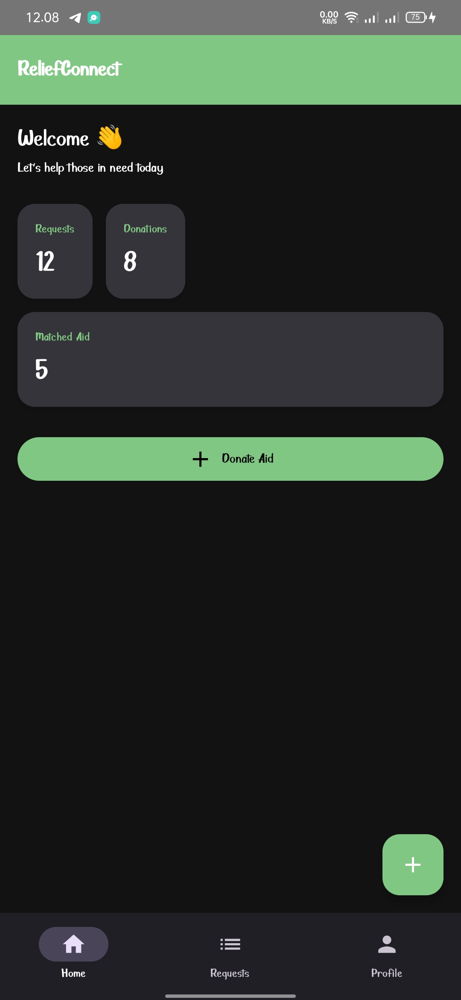
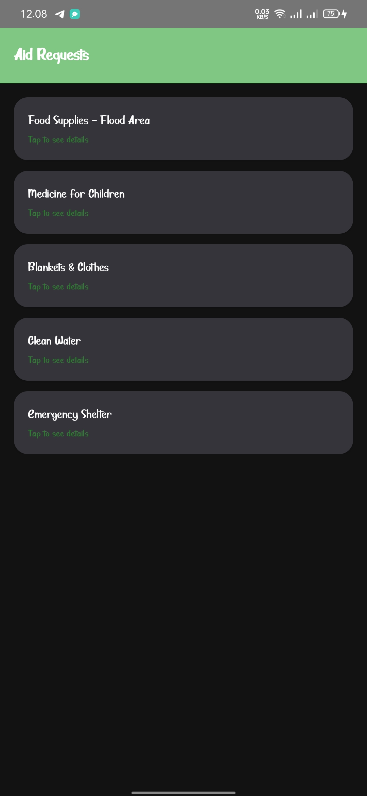
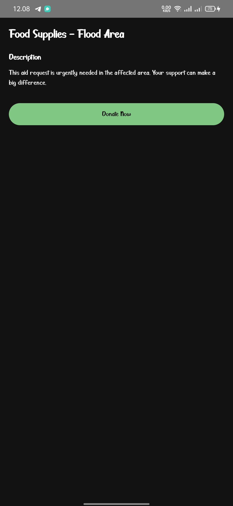
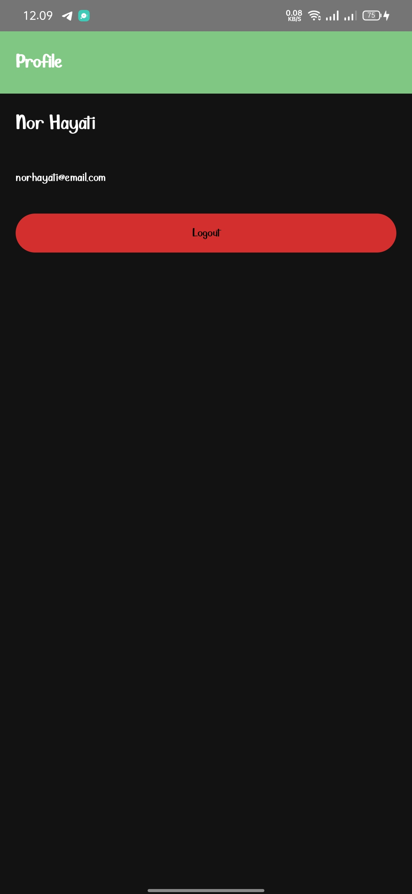

# ReliefConnect 📱

ReliefConnect adalah aplikasi Android berbasis **Jetpack Compose** yang bertujuan untuk menghubungkan kebutuhan bantuan (aid requests) dengan para donatur atau relawan secara digital.  
Aplikasi ini dirancang sebagai proyek **Laporan Akhir / UAS Mobile Programming**.

---

## 👤 Identitas Mahasiswa

- **Nama** : Nor Hayati
- **NIM** : 230104040203
- **Kelas** : TI23A
- **Mata Kuliah** : Mobile Programming

---

##  Latar Belakang Permasalahan
    Dalam situasi bencana atau kondisi darurat, distribusi bantuan sering kali mengalami kendala seperti:
- Informasi kebutuhan yang tidak terdata dengan baik
- Kurangnya transparansi antara permintaan dan pemberi bantuan
- Proses penyaluran bantuan yang lambat dan tidak terkoordinasi

ReliefConnect hadir sebagai solusi digital untuk mempermudah pencatatan, pencarian, dan penyaluran bantuan kemanusiaan melalui aplikasi mobile.

---
## 🎯 Tujuan Aplikasi

- Menampilkan daftar permintaan bantuan
- Memberikan detail permintaan bantuan
- Mengelola autentikasi pengguna (Login & Logout)
- Menyediakan dashboard ringkas untuk pengguna
- Menerapkan arsitektur modern Android (Compose + Navigation)

---

##  Manfaat Aplikasi
- Membantu korban bencana mendapatkan bantuan lebih cepat
- Memudahkan relawan dan donatur menemukan kebutuhan yang paling mendesak
- Mengurangi kesalahan distribusi bantuan

---

## 🧩 Fitur Utama

- ✅ Login & Logout
- 🏠 Home Dashboard
- 📋 Daftar Permintaan Bantuan (Request List)
- 📄 Detail Permintaan Bantuan
- 👤 Halaman Profil
- 🧭 Bottom Navigation
- 🎨 Custom Theme (Material 3)
- 💾 DataStore untuk menyimpan status login

---

## 🧭 Alur Navigasi Aplikasi

1. Login Screen
2. Home Screen
3. Request List Screen
4. Request Detail Screen
5. Profile Screen (Logout)

---

## 🏗️ Teknologi yang Digunakan

- **Bahasa** : Kotlin
- **UI** : Jetpack Compose
- **Design System** : Material 3
- **Navigation** : Navigation Compose
- **State Management** : ViewModel
- **Data Persistence** : DataStore
- **Architecture** : MVVM (Model-View-ViewModel)

---

## 📁 Struktur Folder
```bash
com.reliefconnect.app
│
├── app/
├── gradle/
│
├── navigation
│   ├── AppNavigation.kt
│   └── BottomNavBar.kt
│
├── ui
│   ├── auth
│   │   ├── LoginScreen.kt
│   │   ├── AuthViewModel.kt
│   │   └── AuthViewModelFactory.kt
│   │
│   ├── home
│   │   └── HomeScreen.kt
│   │
│   ├── request
│   │   ├── RequestListScreen.kt
│   │   └── RequestDetailScreen.kt
│   │
│   ├── profile
│   │   └── ProfileScreen.kt
│   │
│   ├── components
│   │   └── AppTopBar.kt
│   │
│   └── theme
│       ├── Color.kt
│       ├── Theme.kt
│       └── Type.kt
│
├── data
│   └── DataStoreManager.kt
│
├── hasiluji
│   ├── 1.jpeg
│   ├── 2.jpeg
│   ├── 3.jpeg
│   ├── 4.jpeg
│   └── 5.jpeg
│
├── MainActivity.kt
│
├── README.md
│
└── build.gradle


```

---

## 🧪 Hasil Uji Aplikasi

Berikut adalah hasil pengujian tampilan aplikasi:

### 🔹 Tampilan Login


### 🔹 Home Dashboard


### 🔹 Daftar Permintaan Bantuan


### 🔹 Detail Permintaan Bantuan


### 🔹 Profile & Logout


---

1. Buka project menggunakan **Android Studio**
2. Pastikan:
    - Gradle sudah sinkron
    - Emulator atau perangkat Android terhubung
3. Klik **Run ▶️**
4. Aplikasi akan menampilkan **Login Screen**
5. Setelah login, pengguna akan diarahkan ke **Home Dashboard**

---

## 🎨 Desain UI

- Menggunakan **Material 3**
- Top App Bar konsisten di setiap screen
- Bottom Navigation untuk navigasi utama
- Tampilan sederhana, bersih, dan responsif


## 📝 Catatan Pengembangan

- Aplikasi masih menggunakan data statis untuk daftar request
- Fitur donasi dan create request belum terhubung ke backend
- Struktur sudah siap untuk pengembangan lanjutan (API, Room, dll)

## Kesimpulan
Aplikasi ReliefConnect dikembangkan sebagai proyek akhir untuk menerapkan konsep pengembangan aplikasi Android modern. Diharapkan aplikasi ini dapat menjadi contoh implementasi Jetpack Compose yang terstruktur, rapi, dan mudah dikembangkan lebih lanjut.
